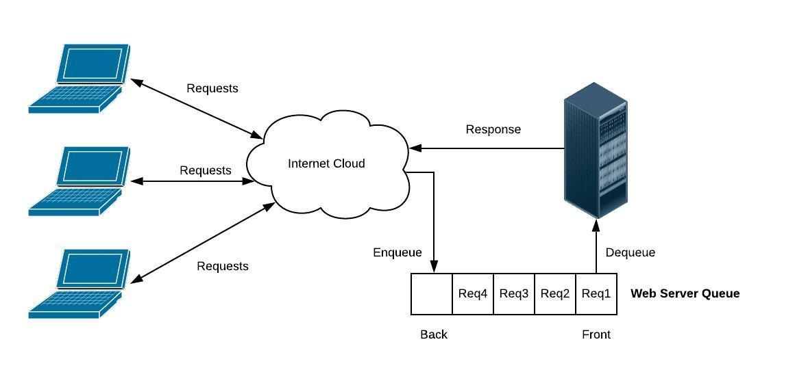
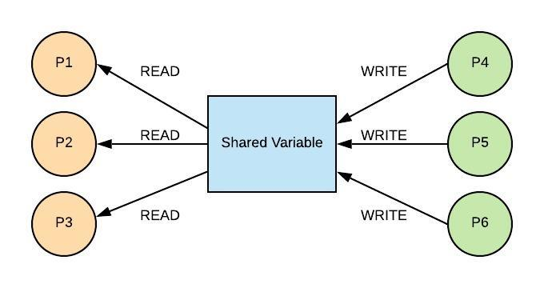

# Queues

### Introduction
Queues are like a line at a grocery store where the first person in line is the first to check out. In computer terms, this is called "First In, First Out" (FIFO). They're useful when you want to keep things in order, such as printing documents one after another. When using queues in C#, adding and removing items is generally quick, with operations taking a consistent amount of time, often referred to as O(1) complexity.

Common uses include managing tasks in an orderly fashion and organizing data for processing. Beginners might encounter issues like handling situations when the queue is full or managing multiple tasks at once, which C# can handle with certain commands to manage concurrency or by setting size limits on queues.

### Grocery Store Queue
- Dequeue: When the item at the front is removed from the queue.
- Enqueue: When a new person joins the queue at the back.
    - Data cannot be entered in the middle of the queue.
    - Used when we need to process a collection of requests in a fair and orderly way.
- Two common queues:
    - Web Server Queue
    - Reader/Writer Queue.

### Web Server Queue
When a request is sent, it is put into a queue until the web server can process the request. In this way, all requests are received and none of them are lost.

Queues frequently have a self-imposed maximum size. If a queue is full, then the software may need to send an error message back to the client.

### Reader/Write Queue
- Process/thread: the need to run different software components concurrently.

Each process will likely have their own set of variables that are maintained. Frequently, there is need to have shared data between the processes

A queue is used to ensure order and integrity.
1. When a process wants to write, it is enqueued. When a process is dequeued, it is then allowed to modify the shared variable.
2. When the process is done, then the next process is dequeued.

### Running Test Cases
- Testing importance in software development: Testing is crucial as it ensures the software functions correctly, meets requirements, and is free from defects. It helps identify bugs early in the development cycle, reducing costs and time needed for fixes later.
- Utilizing inline test code in C# for function validation: Inline testing in C# allows developers to write test cases directly within the codebase. This approach provides immediate validation of functions and methods, making it easier to catch errors during development.
- Contrasting manual result checking with Trace.Assert for automated assertion and error reporting: Manual result checking involves developers manually verifying the output of their code, which is time-consuming and prone to human error. Trace.Assert automates this process by asserting conditions within the code, automatically reporting errors when conditions fail, improving efficiency and reliability.

- Handling testing complexities, such as setting up scenarios involving multiple function calls: Testing complex scenarios requires careful setup to simulate real-world conditions. This may involve mocking dependencies, setting up test environments, and ensuring all interdependent functions are called in the correct order. Effective testing strategies simplify these setups, ensuring thorough coverage.

- Testing aids in understanding software requirements: Writing test cases forces developers to think through the requirements and expected behavior of the software. This process clarifies ambiguities and ensures that the final product meets the specified needs.

- Role of testing in Continuous Integration/Continuous Deployment (CI/CD) models: In CI/CD models, testing is integrated into the development pipeline. Automated tests run with each code commit, ensuring new changes do not break existing functionality. This promotes rapid and reliable software delivery.

- Ensuring software updates don't introduce new issues through rigorous testing: Rigorous testing, including regression tests, ensures that new updates do not inadvertently introduce bugs. This is essential for maintaining software quality over time, particularly in complex systems.

- Automation of assert statements for comprehensive code coverage and efficient testing: Automating assert statements throughout the codebase ensures comprehensive coverage, catching errors across different scenarios and edge cases. This automation enhances testing efficiency, allowing developers to focus on writing code rather than manually checking results.

### Example
**Description**
Imagine you are developing a directory structure for a file system. Each directory can contain files and subdirectories. You need to model this hierarchy to perform operations like adding, searching, and displaying the contents.

**Real World Application**
File systems use tree structures to represent directories and files, allowing for efficient organization, retrieval, and changing of data. Other applications include organizational charts, data management, and navigating XML/HTML documents.

**Identify the Strengths of the Data Structure**
- Hierarchical Organization: Represents relationships between elements naturally, such as parent-child relationships.
- Efficient Search and Insert: Enables efficient insertion, deletion, and searching of elements.
- Flexibility: Can represent a wide range of hierarchical data, from file systems to organizational charts.

**How This Applies in Your Given Application:**
In a file system, using a tree structure allows you to represent the nested hierarchy of directories and files, enabling efficient navigation and management of the data.

**Putting Those Two Things Together**
To model a directory structure, you will use a tree where each node represents a directory or file. This will allow you to add directories/files, search for specific items, and display the structure.

**How to Use the Data Structure to Solve the Problem**
We won't build the tree from scratch. Instead, we'll define a simple tree structure using classes in C# to represent the directory and file hierarchy.

    using System;
    using System.Collections.Generic;

    public class FileSystem
    {
        public static void Main(string[] args)
        {
            DirectoryNode root = new DirectoryNode("root");

            // Create subdirectories and files
            DirectoryNode home = new DirectoryNode("home");
            DirectoryNode user = new DirectoryNode("user");
            FileNode file1 = new FileNode("file1.txt");
            FileNode file2 = new FileNode("file2.txt");

            // Build the tree
            root.AddChild(home);
            home.AddChild(user);
            user.AddChild(file1);
            user.AddChild(file2);

            // Display the tree
            Console.WriteLine("Directory Structure:");
            DisplayTree(root, "");

            // Search for a file
            Console.WriteLine("\nSearching for 'file1.txt':");
            var searchResult = Search(root, "file1.txt");
            if (searchResult != null)
            {
                Console.WriteLine($"Found: {searchResult.Name}");
            }
            else
            {
                Console.WriteLine("Not Found");
            }
        }

        // Display the tree structure
        private static void DisplayTree(Node node, string indent)
        {
            Console.WriteLine(indent + node.Name);
            foreach (var child in node.Children)
            {
                DisplayTree(child, indent + "  ");
            }
        }

        // Search for a node by name
        private static Node Search(Node node, string name)
        {
            if (node.Name == name)
            {
                return node;
            }

            foreach (var child in node.Children)
            {
                var result = Search(child, name);
                if (result != null)
                {
                    return result;
                }
            }

            return null;
        }
    }

    // Base class for nodes
    public abstract class Node
    {
        public string Name { get; }
        public List<Node> Children { get; }

        protected Node(string name)
        {
            Name = name;
            Children = new List<Node>();
        }

        public void AddChild(Node child)
        {
            Children.Add(child);
        }
    }

    // Directory node class
    public class DirectoryNode : Node
    {
        public DirectoryNode(string name) : base(name) { }
    }

    // File node class
    public class FileNode : Node
    {
        public FileNode(string name) : base(name) { }
    }
- Add Elements: Directories and files are added to the tree using AddChild.
- Display Structure: The directory structure is displayed using a recursive method DisplayTree.
- Search: The tree is searched for a specific file or directory using a recursive method Search.

### Problem to Solve: Queue Operations
Task: You need to create a program to interact with a queue. Users will enter integers to enqueue until they type 'done'. Then, the program will display the elements in the queue, dequeue all elements one by one, and display each element being dequeued.

    using System;

    class QueueNode
    {
        public int Data;
        public QueueNode Next;

        public QueueNode(int data)
        {
            Data = data;
            Next = null;
        }
    }

    class Queue
    {
        private QueueNode front;
        private QueueNode rear;

        public Queue()
        {
            front = rear = null;
        }

        // Method to add an item to the queue
        public void Enqueue(int data)
        {
            // TODO: Complete this method to add an item to the queue
        }

        // Method to remove an item from the queue
        public int Dequeue()
        {
            // TODO: Complete this method to remove an item from the queue
        }

        // Method to check if the queue is empty
        public bool IsEmpty()
        {
            return front == null;
        }

        // Method to display the elements of the queue
        public void DisplayQueue()
        {
            QueueNode current = front;
            while (current != null)
            {
                Console.Write(current.Data + " ");
                current = current.Next;
            }
            Console.WriteLine();
        }
    }

    class Program
    {
        static void Main(string[] args)
        {
            Queue queue = new Queue();
            Console.WriteLine("Enter numbers to add to the queue (type 'done' to finish):");

            while (true)
            {
                string input = Console.ReadLine();
                if (input.ToLower() == "done")
                {
                    break;
                }

                if (int.TryParse(input, out int data))
                {
                    queue.Enqueue(data);
                }
                else
                {
                    Console.WriteLine("Invalid input. Please enter a valid integer or 'done' to finish.");
                }
            }

            Console.WriteLine("Elements in the queue:");
            queue.DisplayQueue();

            Console.WriteLine("Dequeueing elements:");
            while (!queue.IsEmpty())
            {
                Console.WriteLine("Dequeued: " + queue.Dequeue());
            }
        }
    }

You can check your code with the solution here: [Solution](queues-problem-solution)

Back to [Welcome Page](0-welcome.md)