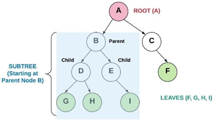

# Trees

### Introduction
Trees in computing are a way to organize data that looks somewhat like a family tree but upside down. The top of the tree is called the root, and it branches out into more nodes (elements) below. In a specific type of tree called a Binary Search Tree (BST), each node keeps smaller values on its left and larger values on its right. This setup allows quick searches, additions, and deletions of nodes, usually taking O(log n) time if the tree is well balanced. This means that operations get slightly slower as the tree grows, but not excessively so. Trees are useful for tasks where data is constantly added and removed, such as managing a dynamically updating list. Common beginner challenges include keeping the tree balanced to maintain efficiency and understanding recursion, which is a concept where a function calls itself to solve problems.


### Binary Trees
**Binary Trees**
Binary tree = tree that links to no more than two other nodes


**Binary Search Trees**
•	Binary Search Tree (BST) = A binary tree that follows rules for data that is put into the tree
•	By using this process, the data is stored in the tree sorted:
1.	Data is placed into the BST by comparing the data with the value in the parent node
2.	If the data being added is less than the parent node, then it is put in the left subtree
3.	If the data being added is greater than the parent node, then it is put in the right subtree
4.	If duplicates are allowed than the duplicate can be put either to the left or to the right of the root

**Balanced Binary Search Trees**
- Balanced Binary Search Tree = a BST such that the difference of height between any two subtrees is not dramatically different
    - Height of a tree can be found by counting the maximum number of nodes between root and the leaves. Since it is not reasonable to expect that the order of data will result in a balanced BST, numerous algorithms have been written to detect if a tree is unbalanced and to correct the unbalance
- Algorithms
    - Red Black Trees
    - AVL (Adelson-Velskii and Landis) trees


### Binary Search Trees Operations
**Inserting**
    - Smaller problem: Insert a value into either the left subtree or the right subtree based on the value.
    - Base case: If there is space to add the node (the subtree is empty), then the correct place has been found and the item can be inserted.
    - Two Insert functions: 
        - The first BinarySearchTree.Insert function is the one called by the user who wants to insert a value into the tree. This function is used to call the recursive function Node.Insert on the root node. As a special case, if the root node is empty (null), then we will put the new Node in the root without using any recursion.
        - The second Node.Insert calls itself until it finds an empty position in which to insert the value.

**Traversing**
    - Smaller problem: Traverse the left subtree of a node, use the current node, and then traverse the right subtree of the node.
    - Base case: If the subtree is empty, then don’t recursively traverse or use anything.

**List of Operations**

**Operation: `Insert(value)`**
    - Inserts a value into the tree.
    - Performance: O(log n) - Recursively search the subtrees to find the next available spot.

**Operation: `Remove(value)`**
    - Removes a value from the tree.
    - Performance: O(log n) - Recursively search the subtrees to find the value and then remove it, including some cleanup of adjacent nodes.

**Operation: `Contains(value)`**
    - Determines if a value is in the tree.
    - Performance: O(log n) - Recursively search the subtrees to find the value.

**Operation: `TraverseForward`**
    - Visits all objects from smallest to largest.
    - Performance: O(n) - Recursively traverse the left subtree, then the right subtree.

 **Operation: `TraverseReverse`**
    - Visits all objects from largest to smallest.
    - Performance: O(n) - Recursively traverse the right subtree, then the left subtree.

**Operation: `Height(node)`**
    - Determines the height of a node, using the root if the full tree height is needed.
    - Performance: O(n) - Recursively find the height of the left and right subtrees and return the maximum height (plus one for the root).

**Operation: `Size()`**
    - Returns the size of the BST.
    - Performance: O(1) - The size is maintained within the BST class.

**Operation: `Empty()`**
    - Returns true if the root node is empty, which can also be determined by checking if the size is 0.
    - Performance: O(1) - The comparison of the root node or the size.

### Example
* Example description- describe the problem or the requirements and then show the student how to get to the answer
* Real world application
* Identify the strengths of the data structure
* Come up with how this applies in your given application
* Put those 2 things together
* how to use the data structure to solve a problem, not how to build the data structure
```Example code```

### Problem to Solve: Name

        using System;

    class Node
    {
        public int Data;
        public Node Left;
        public Node Right;

        public Node(int data)
        {
            Data = data;
            Left = null;
            Right = null;
        }
    }

    class BinaryTree
    {
        public Node Root;

        public BinaryTree()
        {
            Root = null;
        }

        // Method to insert a new node into the binary tree
        public void Insert(int data)
        {
            Root = InsertRec(Root, data);
        }

        // Recursive method to insert a new node into the binary tree
        private Node InsertRec(Node root, int data)
        {
            // TODO: Complete this method to insert a new node into the binary tree
        }

        // Method to perform in-order traversal of the binary tree
        public void InOrder()
        {
            InOrderRec(Root);
        }

        // Recursive method to perform in-order traversal of the binary tree
        private void InOrderRec(Node root)
        {
            // TODO: Complete this method to perform in-order traversal of the binary tree
        }
    }

    class Program
    {
        static void Main(string[] args)
        {
            BinaryTree tree = new BinaryTree();
            Console.WriteLine("Enter numbers to insert into the binary tree (type 'done' to finish):");

            while (true)
            {
                string input = Console.ReadLine();
                if (input.ToLower() == "done")
                {
                    break;
                }

                if (int.TryParse(input, out int data))
                {
                    tree.Insert(data);
                }
                else
                {
                    Console.WriteLine("Invalid input. Please enter a valid integer or 'done' to finish.");
                }
            }

            Console.WriteLine("Inorder traversal of the given tree:");
            tree.InOrder();
        }
    }


You can check your code with the solution here: [Solution](trees-problem-solution)

Back to [Welcome Page](0-welcome.md)